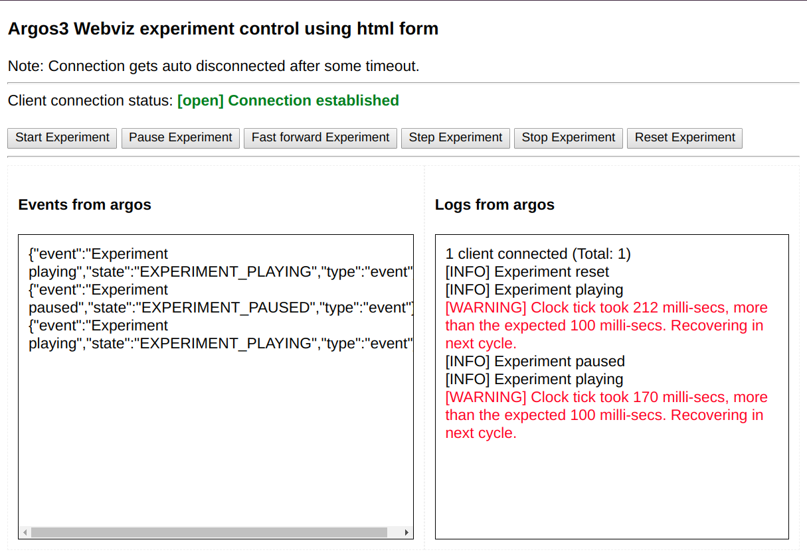
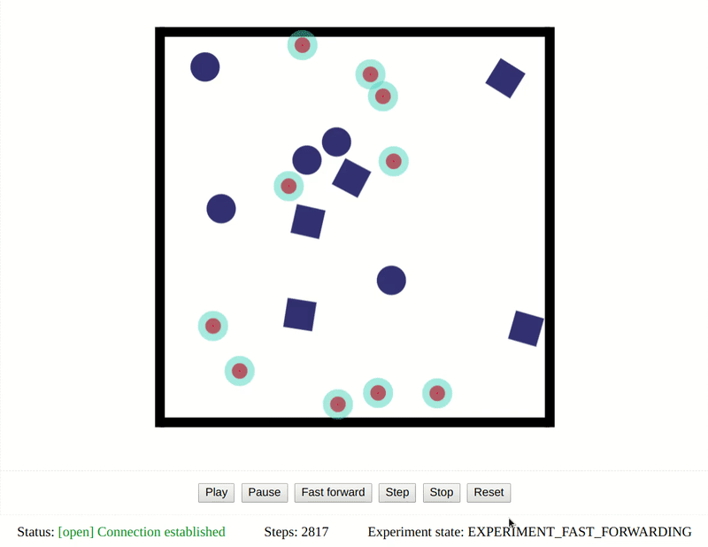

# argos3-webviz-examples
Examples for ARGoS3 Webviz plugin

To compile we assume you have

- Cmake
- Argos3
- Lua (for Argos3)
- Argos3-webviz

To build, run the following commands
```console
$ mkdir build
$ cd build
$ cmake ..
$ make
$ cd ..
```


## Examples
Every example has two parts, a Serverside with argos and webviz, and a client side which can be anything from python client to javascript web application.

> Few of the examples here are taken from [argos3-examples](https://github.com/ilpincy/argos3-examples) with added Webviz as the visualizer.

**PLEASE NOTE:** Make sure that port 3000 is not being used by any other process or existing argos3 webviz experiment, or you need to change experiment file and client accordingly.
### DIFFUSION

In this example experiment, a foot-bot performs obstacle avoidance
while navigating in an small square environment.

To Run, start argos in one terminal
```console
$ argos3 -c diffusion/diffusion_1.argos
```

and run a static webserver to host html files in another terminal
```console
$ python3 -m http.server --directory ./common 8000
```

Now you can open http://localhost:8000/ in any `modern` browser.

Here we use the example webclient provided by "argos3-webviz".


# Basic html form

> 

In this example experiment, the experiment is shown to be controlled
using a html form, and inbuilt WebSockets functionality of javascript.

The experiment is empty (no robots) we only see and control the `State`
of the experiment.

To Run, start argos in one terminal
```console
$ argos3 -c basic_html_form/empty_experiment.argos
```

and run a static webserver to host html files in another terminal
```console
$ python3 -m http.server --directory ./basic_html_form/client 8000
```

Now you can open http://localhost:8000/ in any `modern` browser.

# Basic 2D Viewer

> 

In this example experiment, fabric.js is used to show the 2D arena of robots.

The swarm experiment is diffusion as of above.

To Run, start argos in one terminal
```console
$ argos3 -c basic_2D_viewer/diffusion_10_2D.argos
```

and run a static webserver to host html files in another terminal
```console
$ python3 -m http.server --directory ./basic_2D_viewer/client 8000
```

Now you can open http://localhost:8000/ in any `modern` browser.

# Python client

Install websocket_client using
```console
$ pip install websocket_client
```

To Run, start argos in one terminal
```console
$ argos3 -c ./python_client/empty_experiment.argos
```

and run python client in another terminal
```console
$ python3 ./python_client/client.py
```

# User functions

This example is taken from argos3-examples,

The arena is divided in two areas: a grey area that serves as nest, where
the robots are initially deployed; and a white area where food items
are scattered. The task of the foot-bots is to exit the nest, search
for food items, grab them and bring them back to the nest. To simplify
control, food items are just drawn as black spots on the ground, and
when a robot passes over a food item it automatically grabs it. When a
robot is transporting a food item, a cylinder is drawn on top of
it. Each robot can transport only one item per time. Once a robot has
grabbed an item, it must bring it back to the nest. The direction
to/away from the nest is detectable through light sensors, that read
the position of a set of lights displaced over the nest.

To Run, start argos in one terminal
```console
$ argos3 -c user_functions/foraging.argos
```

and run a static webserver to host html files in another terminal
```console
$ python3 -m http.server --directory ./user_functions/client 8000
```

Now you can open http://localhost:8000/ in any `modern` browser.
